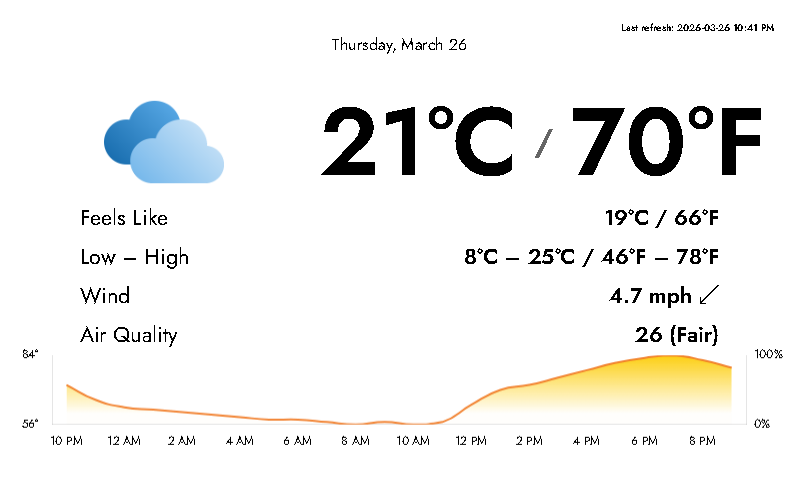

# C°n°F Weather Plugin for InkyPi

A slightly updated version of the original InkyPi weather plugin that displays **both Celsius and Fahrenheit temperatures simultaneously**.



## About

This plugin is based on the official weather plugin from the [InkyPi](https://github.com/fatihak/InkyPi) project.  
The only changes are that it now shows current temperature and lowest–highest temperatures in **both °C and °F** at the same time (e.g. `18°C / 64°F`) and fewer unnecessary info displayed overall.

Perfect if you prefer seeing both units without switching settings.

## Requirements

- [InkyPi](https://github.com/fatihak/InkyPi) installed on your Raspberry Pi

## Installation / Update Steps

1. Make sure you have InkyPi installed and running.

2. Navigate to your InkyPi directory (further commands assume you are in this folder):

   ```bash
   cd ~/InkyPi
   ```

3. Pull this plugin into the existing weather folder (this will overwrite the original weather plugin with the CºnºF version):

   ```bash
   git clone https://github.com/selahssea/inkypi-cnf-weather-plugin.git src/plugins/weather
   ```

   If you already have the plugin cloned and just want to update it later, you can run:

   ```bash
   cd src/plugins/weather
   git pull
   cd ../..
   ```

4. Run the official InkyPi update script to apply the changes https://github.com/fatihak/InkyPi/blob/main/README.md#update:

   ```bash
   sudo bash install/update.sh
   ```

5. After the update finishes, the weather plugin should appear with both Celsius and Fahrenheit displayed.


Original project: [fatihak/InkyPi](https://github.com/fatihak/InkyPi)
